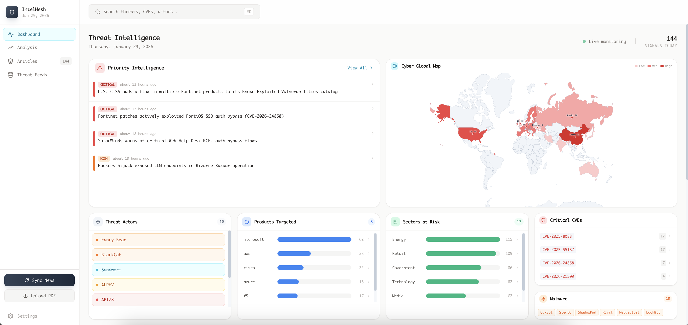
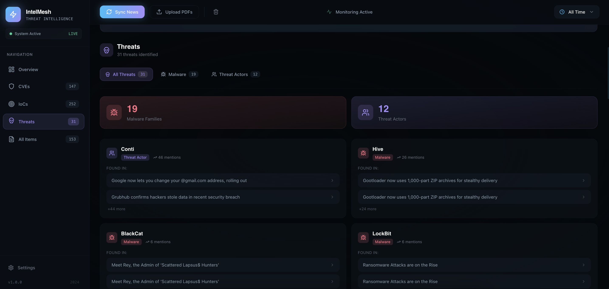
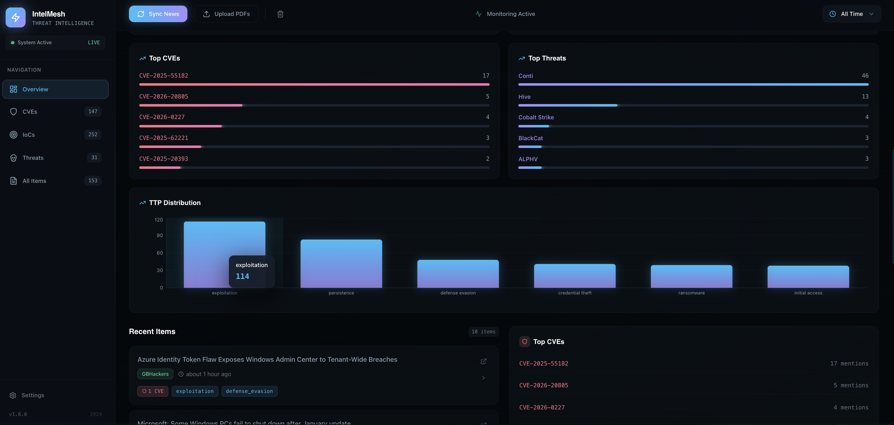
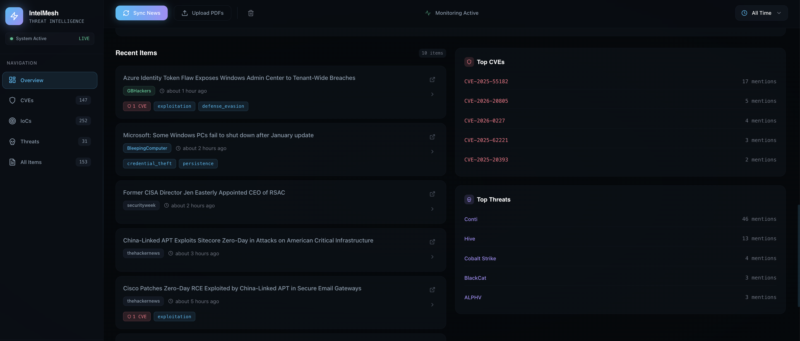

# IntelMesh

A personal threat intelligence platform for security professionals. Aggregate threat feeds, track vulnerabilities, monitor threat actors, and analyze attack patterns—all in a clean, minimal interface.









## Features

### Dashboard
- **Key Risk Indicators**: Exploited CVEs, active threat actors, attack surface, sectors at risk, geographic spread
- **Priority Intelligence**: High-severity items requiring immediate attention
- **Attack Techniques**: Trending TTPs across your intel sources

### Intelligence Briefings
- **Daily/Weekly/Monthly Views**: Curated summaries with time-based filtering
- **Briefing Modes**: Executive (impact-focused), Analyst (investigation angles), Engineer (detection focus)
- **Trend Analysis**: Identify patterns and shifts in the threat landscape

### Threat Feeds
- **OSINT Feeds**: ThreatFox, URLhaus, MalwareBazaar, Feodo Tracker, CISA KEV
- **IoC Types**: IPs, domains, URLs, file hashes
- **CVE Tracking**: Known exploited vulnerabilities with ransomware indicators

### Articles & Analysis
- **12 News Sources**: BleepingComputer, The Hacker News, Krebs on Security, CISA, and more
- **Entity Extraction**: CVEs, IoCs, threat actors, malware families, TTPs
- **Rich Filtering**: By category, severity, and attack type

### Trend Analysis
- **Technique Radar**: Visual representation of attack technique frequency
- **IoC Distribution**: Breakdown by indicator type
- **Threat Actor Tracking**: Monitor active campaigns

## Quick Start

### Prerequisites
- Python 3.9+
- Node.js 18+

### Installation

1. **Clone the repository:**
   ```bash
   git clone https://github.com/kpingul/IntelMesh.git
   cd IntelMesh
   ```

2. **Set up the backend:**
   ```bash
   cd backend
   python3 -m venv venv
   source venv/bin/activate  # Windows: venv\Scripts\activate
   pip install -r requirements.txt
   ```

3. **Set up the frontend:**
   ```bash
   cd ../frontend
   npm install
   ```

### Running

**Terminal 1 - Backend:**
```bash
cd backend
source venv/bin/activate
python -m uvicorn main:app --reload --port 8000
```

**Terminal 2 - Frontend:**
```bash
cd frontend
npm run dev
```

Open http://localhost:3000

## Architecture

```
IntelMesh/
├── backend/
│   ├── main.py           # FastAPI application
│   ├── scraper.py        # RSS/HTML scraping
│   ├── extractors.py     # Entity extraction (CVEs, IoCs, TTPs)
│   ├── threat_feeds.py   # OSINT feed integration
│   ├── pdf_extractor.py  # PDF processing
│   ├── query_parser.py   # Search query parsing
│   └── store.py          # In-memory data store
│
└── frontend/
    └── src/
        ├── app/
        │   ├── page.tsx      # Main dashboard
        │   └── globals.css   # Global styles
        ├── components/
        │   ├── Sidebar.tsx
        │   ├── TodayView.tsx
        │   ├── BriefingsView.tsx
        │   ├── TrendsView.tsx
        │   ├── ThreadsView.tsx
        │   ├── FeedsView.tsx
        │   ├── SettingsView.tsx
        │   └── ThreadDetailPanel.tsx
        ├── lib/api.ts
        └── types/index.ts
```

## API Endpoints

| Endpoint | Method | Description |
|----------|--------|-------------|
| `/api/stats` | GET | Dashboard statistics |
| `/api/items` | GET | All intel items |
| `/api/items/{id}` | GET | Specific item details |
| `/api/cves` | GET | CVEs with counts |
| `/api/iocs` | GET | IoCs by type |
| `/api/threats` | GET | Threats (malware + actors) |
| `/api/sync` | POST | Sync news sources |
| `/api/upload` | POST | Upload PDFs |
| `/api/search` | POST | Search intel |
| `/api/feeds/sync` | POST | Sync threat feeds |
| `/api/feeds/iocs` | GET | Feed IoCs |
| `/api/feeds/cves` | GET | Feed CVEs |

## Tech Stack

- **Backend**: FastAPI, aiohttp, BeautifulSoup4, feedparser, pdfplumber
- **Frontend**: Next.js 14, React 18, Tailwind CSS, Recharts
- **Typography**: Fragment Mono
- **Storage**: In-memory (session-based)

## License

MIT
